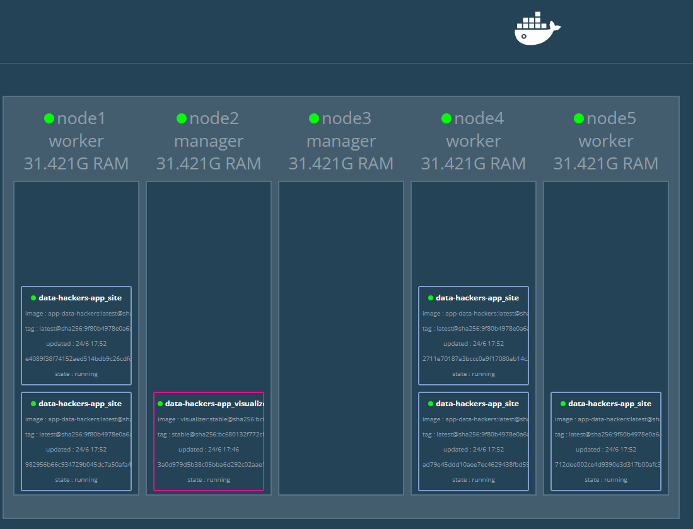

# Docker Swarm

Vamos simular uma orquestração com Docker Swarm no playgrond Docker.

## Steps
### Entre no site 
https://labs.play-with-docker.com/

### Crie 5 instâncias
basta clicar em ```ADD NEW INSTANCE```

sample:


### inicie o Docker Swarm
```
docker swarm init --advertise-addr <ip da instancia> 
```

### Faça join das máquinas com o token do node master
sample:


Para copiar no playground, basta digitar:
```control + insert```

Para colar no Playground, basta digitar:
```control + shift + v```

### Adicione um backup do node master
```
docker node promote node2
```
### Verifique se o cluster está ok
```
docker node ls
```
sample:


### Clone o repositorio
```
git clone https://github.com/wlcamargo/docker_swarm
```

### Entre na pasta do projeto 
```
cd docker_swarm
```

### Crie a stack orquestrada no Swarm
```
docker stack deploy -c docker-compose.yml app-data-hackers_site
```
sample:


### Verifique os serviços rodando no cluster
```
docker service ls
```
sample:


### Serviços / Porta
Para acessar os serviços expostos, basta clicar na porta. Em alguns casos o Playground não faz automaticamente, então será necessário clicar em ```OPEN PORT``` e expor manualmente.

sample:


#### Site: rodando na porta 8003

sample:


#### Visualizer: rodando na porta  8888

sample:


### Escalando a aplicação
```
docker service update --replicas=10 data-hackers-app_site
```

### Remover um serviço
```
docker service rm app-data-hackers_site_site
```

## Developer
| Desenvolvedor      | LinkedIn                                   | Email                        | Portfólio                              |
|--------------------|--------------------------------------------|------------------------------|----------------------------------------|
| Wallace Camargo    | [LinkedIn](https://www.linkedin.com/in/wallace-camargo-35b615171/) | wallacecpdg@gmail.com        | [Portfólio](https://wlcamargo.github.io/)   |


## References

https://docs.docker.com/engine/swarm/
